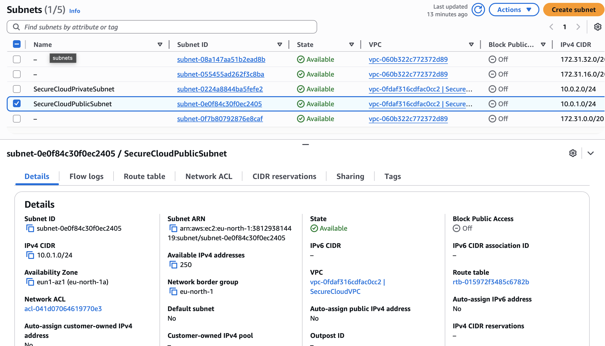
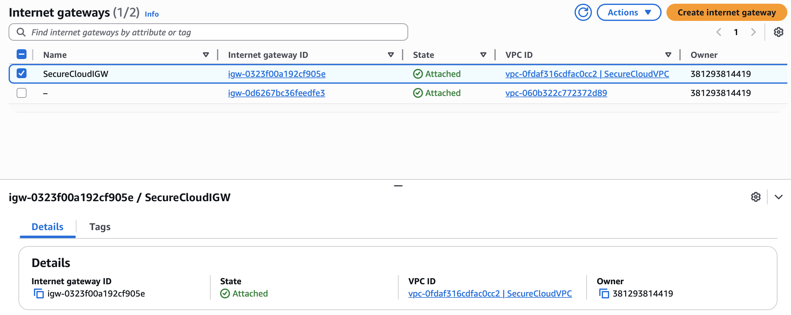
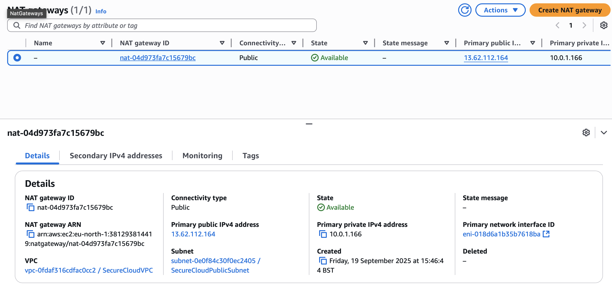

# Implementation Steps

This document walks through the implementation of the **Secure Cloud Environment on AWS** project.  
Each module builds on the previous one, showing how security, resilience, and best practices are applied step by step.

---

## Module 1: Networking Setup – SecureCloudVPC

In this module, I built a **secure network architecture** in AWS to separate public and private resources, following best practices for a production ready environment.  
The goal was to create a **foundational network** that could safely host web applications and backend services while controlling internet access.

---

### What I Did

1. **Created a Custom VPC**
   - Name: `SecureCloudVPC`
   - CIDR block: `10.0.0.0/16`  
   - This defines the entire network range for all resources in the project.

2. **Created Subnets**
   - **Public subnet:** `10.0.1.0/24` – hosts resources that require direct internet access.
   - **Private subnet:** `10.0.2.0/24` – hosts internal resources that should not be directly accessible from the internet.

3. **Internet Gateway (IGW)**
   - Attached to the VPC to allow **public subnet resources** to communicate with the internet.

4. **NAT Gateway**
   - Placed in the public subnet to allow **private subnet resources** to initiate outbound internet connections safely.

   📸 **Screenshot Opportunity:** NAT Gateway details showing Elastic IP and subnet placement.

5. **Route Tables**
   - **Public subnet route table:** routes all internet-bound traffic (`0.0.0.0/0`) to the IGW.
   - **Private subnet route table:** routes all internet-bound traffic to the NAT Gateway.

   📸 **Screenshot Opportunity:** Route tables showing IGW for public and NAT Gateway for private.

---

### Key Takeaways

- Network is **segmented** into public and private zones.  
- Internet access is **controlled and secure**.  
- Setup is **scalable** and ready for additional modules like IAM, S3, and monitoring.

---

## Module 2: IAM Roles and Policies

In this module, I configured **AWS Identity and Access Management (IAM)** to secure the cloud environment.  
The focus was on **least-privilege access**, secure administrative roles, and enforcing **MFA** for human users.

---

### 1️⃣ Create Admin Role

- **Role Name:** `SecureCloudAdminRole`  
- **Policy Attached:** `AdministratorAccess` (AWS Managed)  
- **Purpose:** Provides full administrative access without using the root account.  

**Steps Taken:**
1. Go to **AWS Console → IAM → Roles → Create role**.  
2. Select **AWS service** (trusted entity).  
3. Attach the **AdministratorAccess** policy.  
4. Name the role `SecureCloudAdminRole`.  
5. Ensure MFA is enabled for human users who assume this role.

📸 **Screenshot Opportunity:** Role summary page showing `SecureCloudAdminRole` with AdministratorAccess.

> ✅ Admin tasks are now performed via a secure role instead of the root account.

---

### 2️⃣ Create Resource Roles (Least-Privilege)

To follow best practices, I created dedicated roles for resources, each with only the permissions they require.

| Role Name             | Permissions                  | Use Case                                   |
|-----------------------|-----------------------------|-------------------------------------------|
| `EC2SecureCloudRole`    | EC2 + S3 read/write only     | EC2 instances accessing S3                |
| `S3SecureCloudRole`     | S3 read/write only           | Lambda functions or apps interacting with S3 |
| `CloudTrailSecureRole`  | CloudTrail write to S3 only  | Logging CloudTrail events                  |

**Steps Taken:**
1. Go to **IAM → Roles → Create role**.  
2. Select the **service** that will assume the role:  
   - EC2 → `EC2SecureCloudRole`  
   - Lambda → `S3SecureCloudRole`  
   - CloudTrail → `CloudTrailSecureRole`  
3. Attach only the **required policies**.  
4. Name the roles clearly.  
5. Assign roles to the corresponding resources.  

📸 **Screenshot Opportunity:** IAM roles list showing the three custom roles.

> ✅ Using least-privilege roles minimizes risk and ensures resources only have the access they need.

---

### 3️⃣ Enable MFA for AWS Account

**Purpose:** Adds extra security for human users managing the environment.

**Steps Taken:**
1. Navigate to **IAM → Users → Security credentials → Manage MFA**.  
2. Choose **Virtual MFA device** (Google Authenticator, Authy, etc.).  
3. Scan the QR code and enter two consecutive codes to enable MFA.  

📸 **Screenshot Opportunity:** MFA enabled on a user account.

> ✅ MFA ensures that even if credentials are compromised, administrative access is protected.

---

### Key Takeaways

- Administrative tasks are handled via a **secure admin role**, not the root account.  
- Resources follow the **principle of least privilege**.  
- MFA strengthens the security posture for human accounts.  
- Clear naming conventions improve **auditing and manageability**.  

---

## Coming Next

- **Module 3: S3 Buckets and Encryption** – Setting up encrypted storage with S3 and KMS.  
- **Module 4: Logging and Monitoring** – Enabling CloudTrail, Config, GuardDuty, and alerts.
