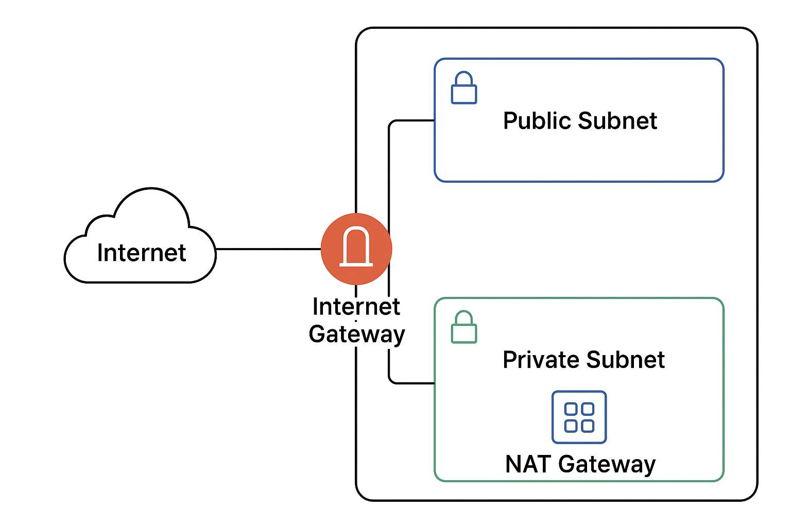

# Secure Cloud Environment on AWS  

## 🚀 Project Overview
This project demonstrates how to build a **secure, resilient cloud environment** on AWS.  
It focuses on **best practices** for network design, identity management, data protection, and monitoring.  

The goal is to create an environment that is **secure by design** while providing a clear example for learning and portfolio purposes.

### Network Diagram

**High-level objectives:**
- Separate network zones for public and private resources
- Secure access with least-privilege IAM policies
- Encrypt sensitive data at rest and in transit
- Enable auditing, monitoring, and threat detection
- Set up alerts for security events

> Non-technical summary: We’re creating a “safe, monitored home” for cloud resources, making sure everything is protected, watched, and controlled.

---

## 🛠 Skills Demonstrated
- Designing **VPCs** with public/private subnets and NAT gateways
- Configuring **IAM roles** and least-privilege policies
- Encrypting data at rest (**S3 + KMS**) and in transit (**ACM + HTTPS**)
- Enabling **CloudTrail**, **AWS Config**, and **GuardDuty** for auditing and threat detection
- Creating **SNS** and **EventBridge** alerts for security events

---

## ☁️ AWS Services Used
| Category                  | Services                                | Purpose                                               |
|----------------------------|----------------------------------------|-------------------------------------------------------|
| Networking                 | VPC, Subnets, NAT Gateway              | Segmentation of public/private resources             |
| Identity & Access          | IAM                                     | Secure access control and permissions                |
| Storage & Encryption       | S3, KMS                                 | Encrypted data storage                                |
| Security & Monitoring      | CloudTrail, Config, GuardDuty          | Auditing and threat detection                        |
| Certificates & HTTPS       | ACM, HTTPS                              | Secure communication                                  |
| Event Notifications        | SNS, EventBridge                        | Security event notifications                         |

---

## 📌 Implementation Steps
1. **Networking Setup** – Build VPC with public/private subnets and NAT gateway  
2. **IAM Configuration** – Create roles and policies following least-privilege principles  
3. **Data Protection** – Enable encryption for S3 buckets and configure HTTPS using ACM  
4. **Monitoring & Alerts** – Activate CloudTrail, Config, and GuardDuty; set up SNS/EventBridge notifications  

> Detailed technical instructions are in [Implementation.md](./Implementation.md).

---

## ⚡ Key Takeaways
- Practical experience in **secure AWS architecture design**
- Applied **defense-in-depth principles** for cloud workloads
- Learned how to **monitor, detect, and respond** to security events

---

## 📝 Next Steps
- Implement automated remediation for security alerts  
- Expand monitoring coverage with **CloudWatch dashboards**  
- Integrate additional compliance checks and logging sources  

