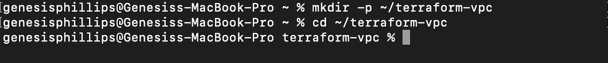
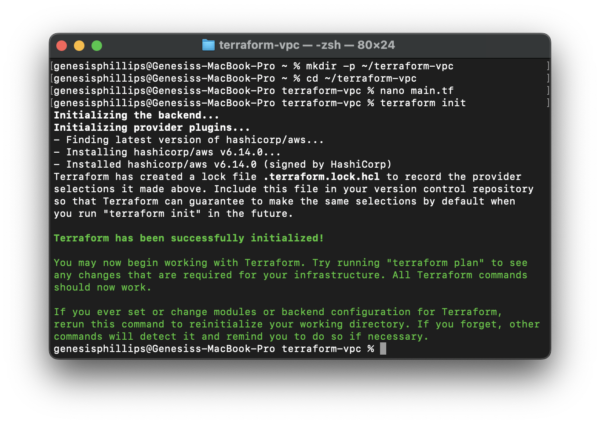
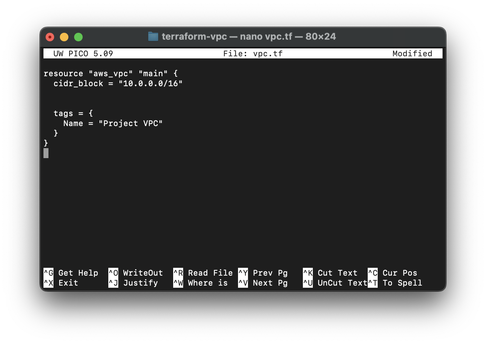
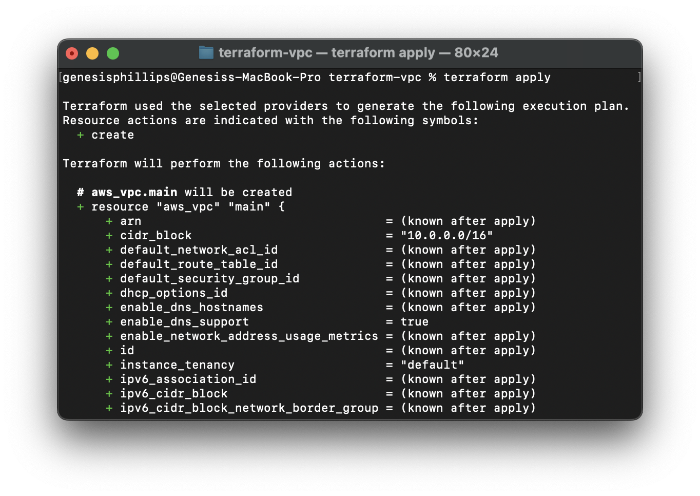
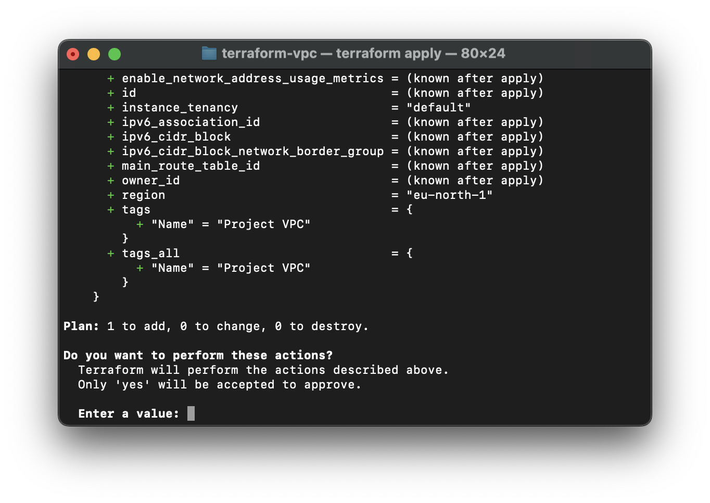
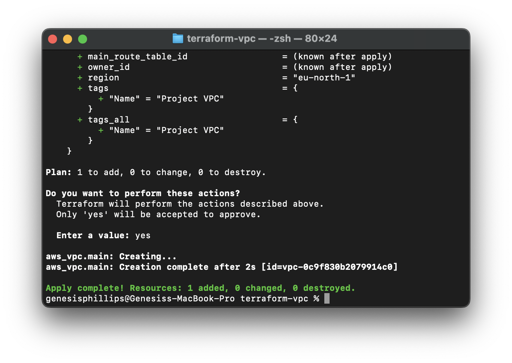
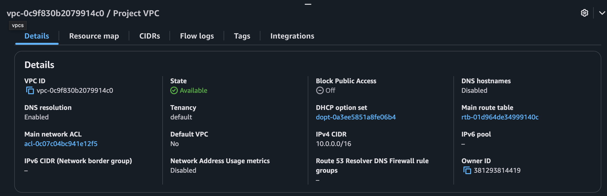
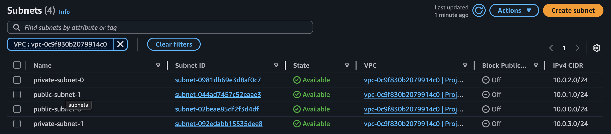

# AWS Networking Setup with Terraform

This document explains the key Terraform configuration files used to build the AWS network infrastructure.

---

## Objective

This document explains the **Networking Architecture with Terraform** project. The goal is to show how to build a secure and organized cloud network on AWS using Terraform. Through this project, you’ll get hands-on experience with key cloud networking concepts and Infrastructure as Code (IaC). It’s designed to help you learn how to set up isolated networks, manage secure access, and automate infrastructure in a way that’s easy to repeat and manage.

## Prerequisites

Before you start, it helps to have:

- Basic knowledge of AWS services like VPCs, subnets, and security groups
- Some experience with Terraform and how it works
- Understanding of basic networking (IP addresses, routing, firewalls)
- Access to the AWS CLI and an AWS account with the right permissions

## Technologies Used

This project uses:

- **AWS:** The cloud platform where the network runs
- **Terraform:** The tool used to write and manage infrastructure as code
- **VPC (Virtual Private Cloud):** To create private networks in AWS
- **Security Groups:** Virtual firewalls controlling network traffic
- **Internet Gateway & Route Tables:** To enable internet access and manage traffic flow

---

## Step 1: Create a Project Folder

Open your terminal and run:



## Step 2: Create a Terraform config file

Create a file called main.tf inside ~/terraform-vpc and leave the files empty for now. type 'terraform ini' to initialise the setup



## Step 3: Create Virtual Private Cloud (VPC)

To begin with, we are going to start by defining our Virtual Private Cloud (VPC) resource in Terraform. To specify a range of IP addresses in a VPC, a Classless Inter-Domain Routing (CIDR) block needs to be provided. We have also provided a name tag for identification.

Create a file called vpc.tf inside ~/terraform-vpc. This is where we will paste this code:





Since we are creating a VPC by applying this configuration a main route table and network ACL is also created. The VPC is also associated with pre-exisiting DHCP option set, as shown in the below screenshot. Take notes of this as we will need this info later.




## Step 4: Create Subnets (Public and Private)

The VPC exists across all the Availability Zones in a region. while subnets are associated with a single AZ. The Stockholm (eu-north-1) region has three AZs and we need one public (to access the internet) and one private subnet (for internal stuff like databases) in 2 AZs to keep it simple.


```hcl
data "aws_availability_zones" "available" {}

resource "aws_subnet" "public" {
  count             = var.public_subnet_count
  vpc_id            = aws_vpc.main.id
  cidr_block        = cidrsubnet(aws_vpc.main.cidr_block, 8, count.index)
  availability_zone = element(data.aws_availability_zones.available.names, count.index)

  map_public_ip_on_launch = true

  tags = {
    Name = "public-subnet-${count.index}"
  }
}

resource "aws_subnet" "private" {
  count             = var.private_subnet_count
  vpc_id            = aws_vpc.main.id
  cidr_block        = cidrsubnet(aws_vpc.main.cidr_block, 8, count.index + 2)
  availability_zone = element(data.aws_availability_zones.available.names, count.index)

  map_public_ip_on_launch = false

  tags = {
    Name = "private-subnet-${count.index}"
  }
}

```


As we can see from the above screenshot, we have successfully created 4 subnets.

## Step 3: Set up Internet Gateway

```hcl
resource "aws_internet_gateway" "igw" {
  vpc_id = aws_vpc.main.id

  tags = {
    Name = "Project VPC IGW"
  }
}

```

## Step 4: Create a Second Route Table

```hcl
resource "aws_route_table" "public_rt" {
  vpc_id = aws_vpc.main.id

  route {
    cidr_block = "0.0.0.0/0"
    gateway_id = aws_internet_gateway.igw.id
  }

  tags = {
    Name = "public-rt"
  }
}

resource "aws_route_table_association" "public_assoc" {
  count          = 2
  subnet_id      = aws_subnet.public[count.index].id
  route_table_id = aws_route_table.public_rt.id
}
```

## Step 5: Create a Security Group

```hcl
resource "aws_security_group" "public_sg" {
  name        = "public-sg"
  description = "Allow SSH from my IP and HTTP from anywhere"
  vpc_id      = aws_vpc.main.id

  ingress {
    description = "SSH from my IP"
    from_port   = 22
    to_port     = 22
    protocol    = "tcp"
    cidr_blocks = [var.allowed_ssh_ip]  # Replace with your actual IP in the variables.tf file!
  }

  ingress {
    description = "HTTP from anywhere"
    from_port   = 80
    to_port     = 80
    protocol    = "tcp"
    cidr_blocks = ["0.0.0.0/0"]
  }

  egress {
    description = "Allow all outbound traffic"
    from_port   = 0
    to_port     = 0
    protocol    = "-1"
    cidr_blocks = ["0.0.0.0/0"]
  }

  tags = {
    Name = "public-security-group"
  }
}

```
