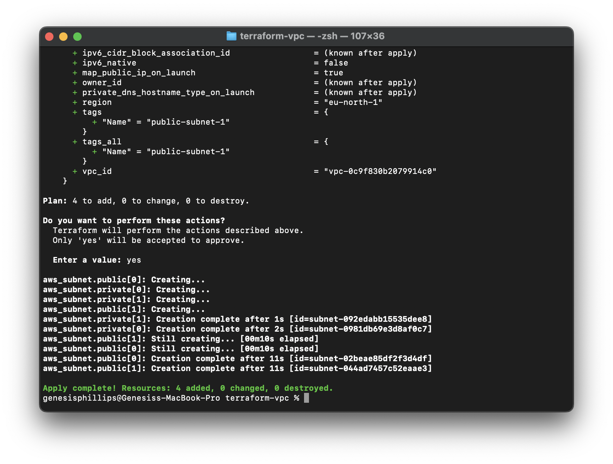

# AWS Networking Setup with Terraform

This document explains the key Terraform configuration files used to build the AWS network infrastructure.

> **Note:** I started building this project using hardcoded configuration, and halfway through I decided to switch to a **modular format** as this is considered best practice and more maintainable in the long term.

---

## 📁 Step 1: Create a Project Folder

Open your terminal and run:


---

## 📄 Step 2: Create a Terraform Config File

Create a file called `main.tf` inside `~/terraform-vpc` and leave the file empty for now.

Then, initialize Terraform by running:

```bash
terraform init
```


---

## Step 3: Create Virtual Private Cloud (VPC)

To begin, we’ll define our Virtual Private Cloud (VPC) in Terraform. A VPC needs a CIDR block, which is a range of IP addresses.
We’ve also added a name tag for easier identification.
Create a file called vpc.tf inside ~/terraform-vpc. This is where we will paste the following code:


Since we are creating a VPC, AWS will also automatically create a main route table, network ACL, and associate it with a default DHCP option set. Make note of this, as we will need this info later.


---

## Step 4: Create Subnets (Public and Private)

A VPC exists across all the Availability Zones (AZs) in a region, while subnets are specific to a single AZ.
The Stockholm (eu-north-1) region has three AZs. For simplicity, we’ll use 2 AZs and create:

- one public (to access the internet)
- one private subnet (for internal stuff like databases) 

in each AZ.




This setup creates a private network in the cloud using AWS in the Stockholm region. Within this network, it creates two types of smaller areas:

- Public areas that can connect to the internet
- Private areas that are isolated and used for internal services

These areas are spread across two different data centers (Availability Zones) to ensure the system stays up even if one zone has an issue. Each area (subnet) has a unique range of IP addresses and is clearly labeled for easy management.


As shown above, we’ve successfully created 4 subnets.

---

## Step 5: Set up Internet Gateway

Since we’re building public subnets, we need to give them access to the internet using an Internet Gateway (IGW).
The resource block below shows the configuration used to create one:


We’ve associated this IGW with the VPC we created earlier by specifying the VPC ID.
Apply this configuration and verify the result:


---

## Step 6: Create a Second Route Table

When a VPC is created, a main route table is also created. This handles traffic within the VPC.

As shown above, there’s no explicit association of any subnet to the main route table, but all subnets are implicitly associated by default.

At this point, even though some subnets are named Public, they are still private because there is no route for internet traffic.

To fix this:
- We create a new route table
- Add a route to the internet (via the Internet Gateway)
- Associate this route table with our public subnets


The screenshot above shows the main route table and that there is no explicit association of any subnet to this route table. However, if you scroll down, all the subnets are associated implicitly. This is the default setting.


At this moment, even though the subnets are called Public and Private, they are all private. To make the subnets named “Public” public, we have to create routes using IGW which will enable the traffic from the Internet to access these subnets.

As a best practice, we create a second route table and associate it with the same VPC as shown in the below resource block. Note that we have also specified the route to the internet (0.0.0.0/0) using our IGW.


Now verify that your new route table exists and is correctly configured:


---

## Step 7: Create a Security Group

Security Groups are like firewalls that control who can access what.

We create a new Security Group to allow only necessary traffic (e.g., SSH, HTTP, etc.).


Verify the creation of the Security Group in the AWS Console:


---

## 🎉 Setup Complete

AWS network infrastructure is now successfully deployed using Terraform!
